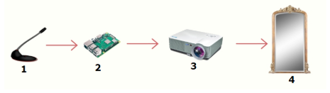

# [Objetos Inteligentes Conectados] 09 out. 2019

## Turma 5J11
## Projeto: "Espelho Inteligente"
## Integrantes do grupo:

* Leticia Souza
* Nathalia Sellis
* Rafael Acayaba
* Fernando 

## Descrição resumida do projeto

A proposta do projeto é criar um espelho inteligente, toda pergunta realizada será refletida no espelho.  

## Descrição do hardware utilizado :

Módulo de reconhecimento de Voz
O Módulo de Reconhecimento de Voz Geeetech recebe comandos à distância para microprocessadores como Arduino, Raspberry Pi, Arm, e PIC, sem a necessidade de botões ou outro tipo de hardware.

Raspberry PI 3 Model B
O Raspberry PI 3 B é um microprocessador de baixo custo e abriga processador, processador gráfico, slot para cartões de memória, interface USB, HDMI e seus respectivos controladores. Além disso, ele também apresenta memória RAM, entrada de energia e barramentos de expansão.
Comparando o Raspberry PI com o Arduino, por exemplo, a funcionalidade mais relevante para definir o microprocessador utilizado é a possibilidade de instalar um sistema operacional, no caso raspbian, além de ter módulo wi-fi para conexão com a internet, este foi o principal fator de escolha. 

Projetor Unic uc-46
O projetor Unic, modelo uc-46 "Wifi Ready" é um aparelho que tem a função de exibir informações utilizando lumens para realizar suas projeções. Este projetor contém 1.200 lumens, sendo assim, sua capacidade de exibição das imagens é mais efetiva em lugares com baixa claridade.
	
Por fim, é utilizado um espelho.

 
 ### Protótipo

 
_______________________________________
Obs:

`src/` deve conter os códigos desenvolvidos

`doc/` documentação do projeto
