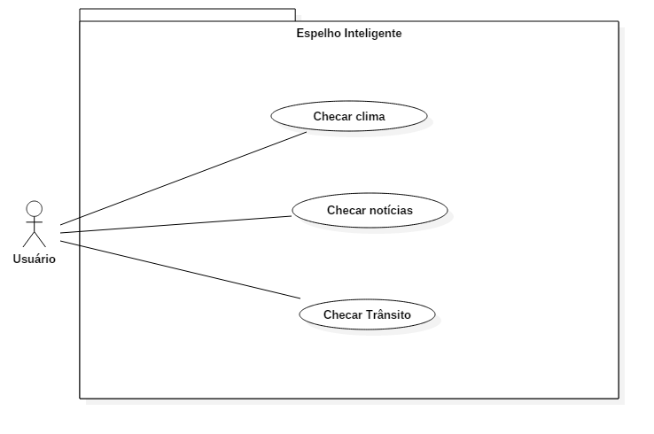

# Casos de uso

## 1. Diagrama de casos de uso

## 2. Especificação dos casos de uso

**Instruções do professor**: Para cada caso de uso, criar as tabelas com a especificação do caso de uso. Siga o exemplo dado abaixo:

### 2.1. Caso de uso **REGISTRAR CHAMADO**

| Campo          | Informação        |
|---|---|
| Identificador: | UC01              |
| Nome:          | Checar Notícia |
| Atores:        | Usuário |
| Sumário:       | Exibe notícias |

| Fluxo Principal |
|---|
| 1) O usuário pergunta para ao espelho "Checar notícia". |
| 2) O sistema retorna as informações de notícias no site G1.|                   
| 3) O sistema  apresenta as notícias para o usuário. |

| Campo          | Informação        |
|---|---|
| Identificador: | UC02              |
| Nome:          | Checar Clima |
| Atores:        | Usuário |
| Sumário:       | Exibe o clima da localização atual do usuário|

| Fluxo Principal |
|---|
| 1) O usuário pergunta para ao espelho "Checar clima". |
| 2) O sistema retorna as informações de clima no site clima tempo.|                   
| 3) O sistema  apresenta as informações para o usuário. |

| Campo          | Informação        |
|---|---|
| Identificador: | UC03              |
| Nome:          | Checar Notícia |
| Atores:        | Usuário |
| Sumário:       | Exibe o trânsito das proximmidades |

| Fluxo Principal |
|---|
| 1) O usuário pergunta para ao espelho "Checar trânsito". |
| 2) O sistema retorna as informações de trânsito do aplicativo waze.|                   
| 3) O sistema  apresenta as informações de trânsito para o usuário. |

