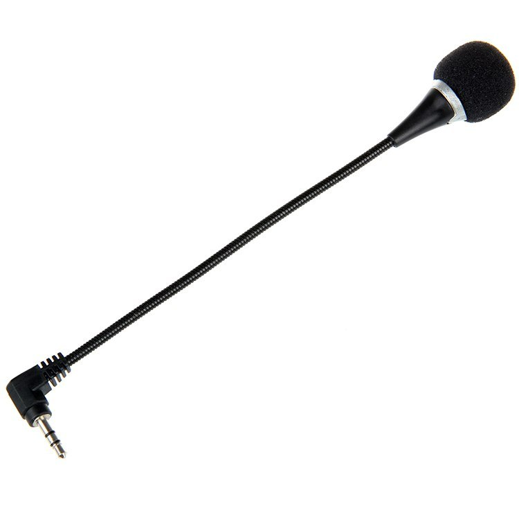
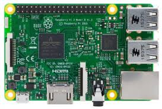
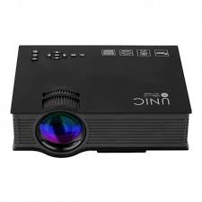

# Descriçao do Hardware

Deve conter:

1) Lista de Peças (descrição e imagens, quando disponíveis)
O Módulo de Reconhecimento de Voz Geeetech recebe comandos à distância para microprocessadores como Arduino, Raspberry Pi, Arm, e PIC, sem a necessidade de botões ou outro tipo de hardware.

### Módulo Geeetech

O Raspberry PI 3 B é um microprocessador de baixo custo e abriga processador, processador gráfico, slot para cartões de memória, interface USB, HDMI e seus respectivos controladores. Além disso, ele também apresenta memória RAM, entrada de energia e barramentos de expansão. Comparando o Raspberry PI com o Arduino, por exemplo, a funcionalidade mais relevante para definir o microprocessador utilizado é a possibilidade de instalar um sistema operacional, no caso raspbian, além de ter módulo wi-fi para conexão com a internet, este foi o principal fator de escolha.

### Raspberry PI 3 B

Projetor Unic uc-46 O projetor Unic, modelo uc-46 "Wifi Ready" é um aparelho que tem a função de exibir informações utilizando lumens para realizar suas projeções. Este projetor contém 1.200 lumens, sendo assim, sua capacidade de exibição das imagens é mais efetiva em lugares com baixa claridade.

### Módulo Geeetech

Por fim, é utilizado um espelho.

2) Desenho Tinkercad ou Fritzing
Não encontramos raspberry no tinkercad

3) Esquema eletrônico

4) Materiais para confecção de caixas e consoles (ou arquivos para impressão 3D)
N/A
